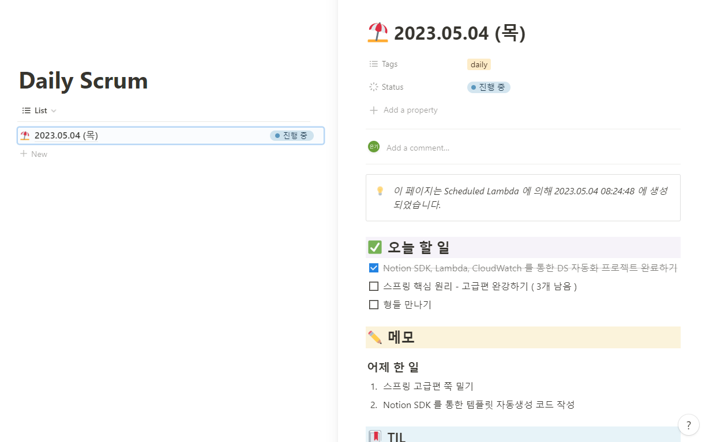

# Notion Daily Scrum 작성 자동화
* 매일 아침 6시에 노션에 하루 일과를 정리하기 위한 문서를 자동으로 작성하기 위한 프로젝트입니다.

## 소스코드 활용법
* 기본적으로 Lambda 는 Node.js 의 런타임만을 제공할 수 있기때문에 Typescript 로 작성된 소스코드를 js로 빌드해야합니다.
  * 다음 명령어를 참고해주세요.
    ```shell
    $ tsc --target esnext --module commonjs --esModuleInterop true  function/index.ts
    ```
* AWS Lambda, EventBridge(Cron) 을 활용하여 AWS Lambda 서비스에 함수를 등록하여 원하는 일정마다 실행할 수 있습니다. ( 하단 문서 참고 )

### Notion 화면



## References
[Lambda 스케줄링으로 매일 아침 자동으로 노션 페이지 만들기](https://velog.io/@oneook/create-notion-page-with-lambda-scheduling#lambda-handler%EB%A1%9C-%EB%A7%8C%EB%93%A4%EA%B8%B0)

[TypeScript를 사용하여 Lambda 함수 빌드](https://docs.aws.amazon.com/ko_kr/lambda/latest/dg/lambda-typescript.html)

[Node.js를 사용하여 Lambda 함수 빌드](https://docs.aws.amazon.com/ko_kr/lambda/latest/dg/lambda-nodejs.html)

[Amazon EventBridge](https://aws.amazon.com/ko/eventbridge/)
